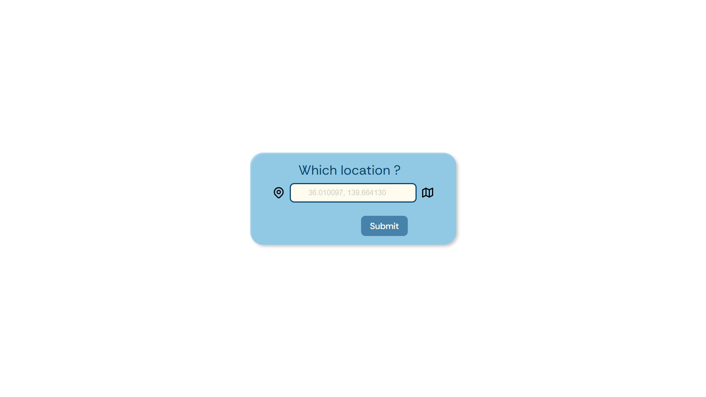

# Weather App

This project is a simple weather application that allows users to search for current weather conditions in any city. The app displays temperature and weather status icon using a clean and user-friendly interface.

## Preview

[Live Preview on GitHub Pages](https://vicker14.github.io/weather-app/)

## Features

- Search for weather by coordinates
- Display current temperature and weather conditions
- Designed for desktop

## APIs Used

- **OpenWeatherMap API**: Provides real-time weather data including temperature, humidity, wind speed, and weather descriptions for any location worldwide.
- **Geolocation API (optional)**: Used to detect the user's current location and display local weather information automatically.
